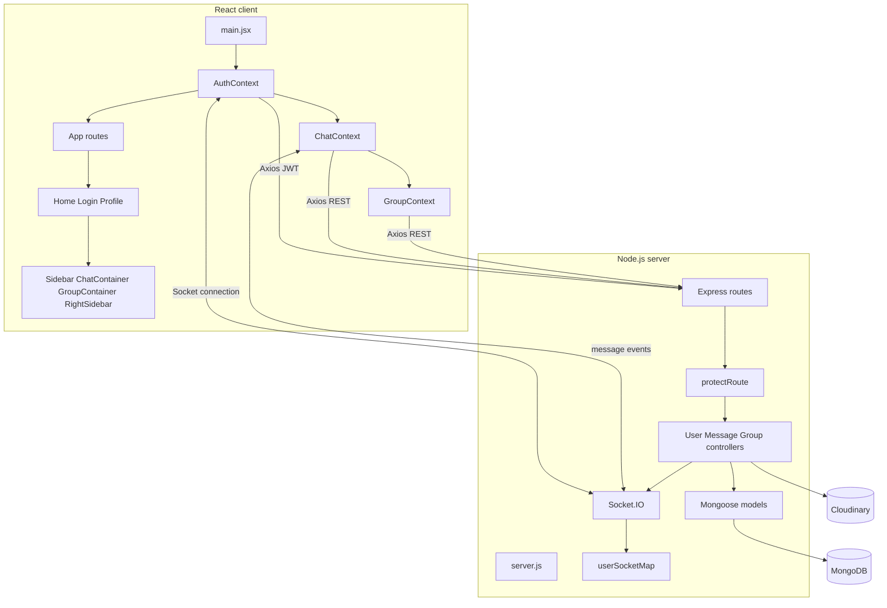
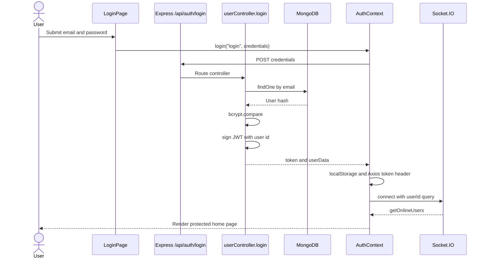
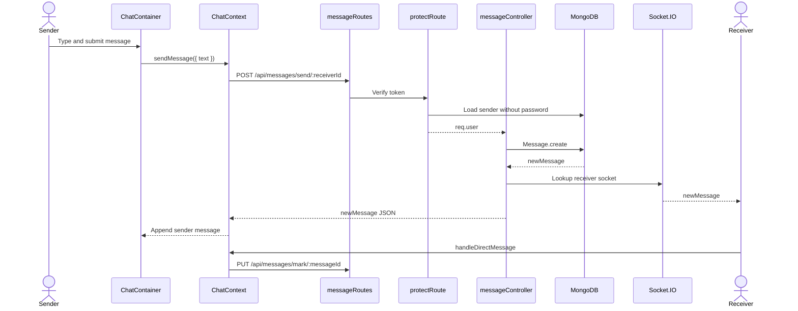
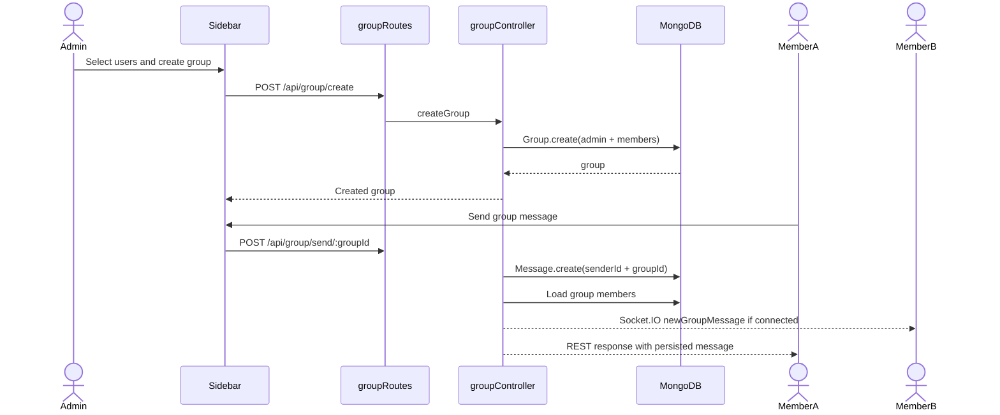
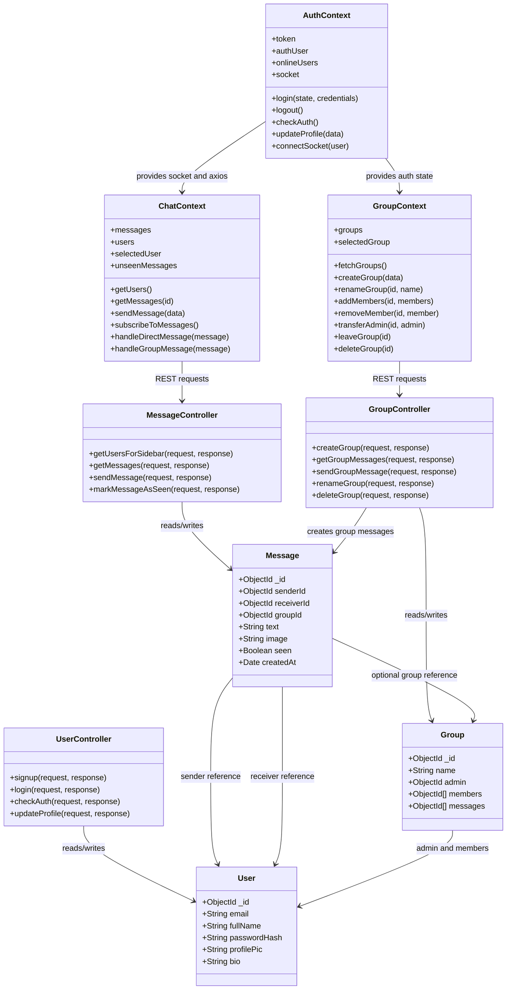
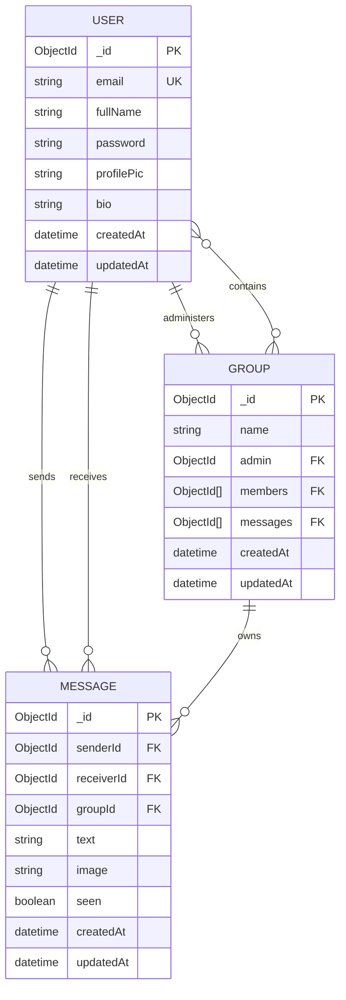

# ChatApp Diagrams

These diagrams describe the current application. Mermaid diagrams can be rendered in VS Code extensions, GitHub, and many Markdown viewers.

## Component architecture

## Login and authentication sequence

## Direct chat sequence

## Group chat sequence

## Class-style design diagram

This is a conceptual class diagram of the main runtime responsibilities. React contexts and Express controllers are modules/functions rather than traditional classes, so the diagram uses class notation to show responsibility and relationships.

## Entity relationship diagram

## ERD explanation

- One user can send many messages.
- One user can receive many direct messages.
- A message has either a direct recipient or a group id in the intended application flow.
- A user can administer many groups over time.
- A group contains many users, and a user can belong to many groups. MongoDB represents this many-to-many relationship with the `members` array on `Group`.
- A group can have many messages through `Message.groupId`.
- The `Group.messages` array is present in the schema but is not maintained by the current controllers. The actual group-message relationship is currently the `groupId` field on `Message`.

## Interview whiteboard order

When asked to draw the system, use this order:

1. Browser with React contexts and chat components.
2. REST arrow to Express routes and `protectRoute`.
3. Controllers to MongoDB and Cloudinary.
4. A separate Socket.IO connection from the browser to the server.
5. Server-side user-to-socket mapping.
6. Message flow: persist first, emit second, fetch history for recovery.
7. Add scaling notes: Redis adapter, rooms, indexes, pagination, and authorization.
