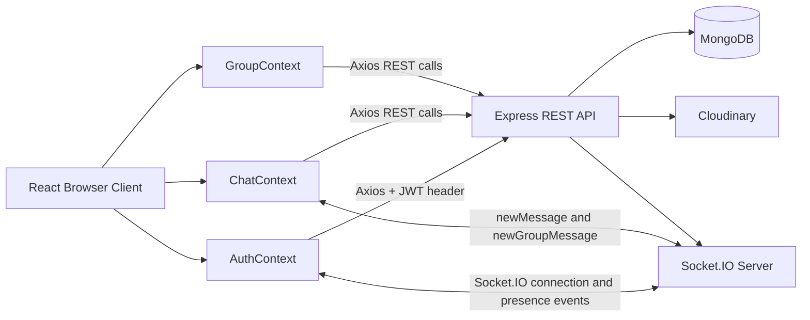

# ChatApp Interview Guide

## 1. Thirty-second introduction

ChatApp is a full-stack real-time messaging application. The frontend is built with React and Vite, the backend uses Node.js with Express, MongoDB stores users, groups, and messages through Mongoose, Cloudinary stores uploaded images, and Socket.IO provides real-time presence and message notifications.

The application supports:

- User signup, login, logout, and profile updates
- JWT-based authentication
- One-to-one text and image messaging
- Group creation and group administration
- Online/offline presence
- Unseen-message counts
- Responsive chat, sidebar, profile, and group interfaces

A useful design explanation is: REST APIs handle authentication, fetching history, persistence, and commands; Socket.IO handles events that should appear immediately on connected clients.

## 2. Technology stack

| Layer | Technology | Responsibility |
|---|---|---|
| UI | React 19 | Components and user interaction |
| Build tool | Vite | Development server and production bundling |
| Routing | React Router | Login, home, and profile routes |
| Client state | React Context and hooks | Auth, chat, group, socket state |
| HTTP | Axios | REST API calls |
| Realtime | Socket.IO client/server | Presence and live message delivery |
| API | Node.js and Express | HTTP endpoints and middleware |
| Database | MongoDB and Mongoose | Persistent application data |
| Authentication | JWT and bcryptjs | Stateless identity and password hashing |
| Images | Cloudinary | Image upload and hosted URLs |
| Deployment shape | Vercel-compatible exports | Server exports the HTTP server for production |

## 3. High-level architecture

## 4. Request lifecycle

### Authentication

1. The user submits signup or login details from the login page.
2. The client sends `POST /api/auth/signup` or `POST /api/auth/login`.
3. The controller validates input, finds or creates the user, and hashes passwords with bcrypt.
4. The server signs a JWT containing the user id.
5. The client stores the token in `localStorage` and adds it to Axios headers as `token`.
6. The client opens a Socket.IO connection with `userId` in the handshake query.
7. The server maps that user id to the connected socket id.

### Protected REST request

1. The browser sends the JWT in the `token` request header.
2. `protectRoute` verifies the token using `JWT_SECRET`.
3. The middleware loads the user without the password and places it on `req.user`.
4. The controller performs the requested operation.
5. The response returns JSON to the client.

### Direct message

1. The user selects a contact and the client loads history with `GET /api/messages/:id`.
2. The sender submits text or a base64 image.
3. The client calls `POST /api/messages/send/:receiverId`.
4. The server uploads an image to Cloudinary when needed.
5. The server creates a `Message` document in MongoDB.
6. The server looks up the receiver socket in `userSocketMap`.
7. If the receiver is connected, the server emits `newMessage` to that socket.
8. The sender appends the REST response immediately; the receiver appends the socket event.
9. When the message is opened or received in the active conversation, the client marks it seen.

### Group message

1. The user selects a group and the client loads `GET /api/group/messages/:id`.
2. The client calls `POST /api/group/send/:groupId`.
3. The server stores a message with `senderId` and `groupId`.
4. The server loads the group members.
5. It sends `newGroupMessage` to each connected member except the sender.
6. Members in the active group append it immediately; other members increase an unseen count.

## 5. Frontend organization

### Providers

`main.jsx` nests providers in this order:

- `AuthProvider`: token, authenticated user, Axios, socket, online users
- `ChatProvider`: contacts, selected conversation, messages, unseen counts
- `GroupProvider`: groups and group administration actions
- `App`: route protection and page rendering

### Routes

- `/`: protected home page
- `/login`: public login/signup page
- `/profile`: protected profile page

`App.jsx` uses `Navigate` to redirect unauthenticated users to login and authenticated users away from login.

### Chat state

`ChatContext` centralizes:

- Loading contacts
- Loading direct or group history
- Sending direct or group messages
- Subscribing to `newMessage` and `newGroupMessage`
- Appending active-chat messages
- Incrementing unseen counts for inactive chats

The selected item has an `isGroup` flag. That lets the same chat provider choose between direct-message and group-message endpoints.

## 6. Backend organization

- `server.js`: creates Express and the HTTP server, configures Socket.IO, middleware, routes, and database startup
- `routes/`: maps HTTP methods and paths to controllers
- `controllers/`: application/business logic
- `middleware/auth.js`: JWT verification and user loading
- `models/`: Mongoose schemas
- `lib/db.js`: MongoDB connection
- `lib/cloudinary.js`: Cloudinary configuration
- `lib/utils.js`: JWT creation helper

The controller layer imports the Socket.IO instance and socket map from `server.js`, which allows a successful message command to persist data and emit a realtime event in one flow.

## 7. Security explanation

- Passwords are never stored as plain text; bcrypt hashes them with a generated salt.
- JWT authentication avoids storing server-side sessions for HTTP requests.
- Protected routes verify the JWT and load the current user from MongoDB.
- Password fields are excluded when users are returned to the client.
- Cloudinary stores media, so the application stores a URL instead of a binary image in MongoDB.
- CORS is enabled so the separately hosted frontend can call the backend.

### Security improvements I would mention in an interview

The current code sends the JWT in a custom `token` header and stores it in `localStorage`. A production hardening plan would use an `Authorization: Bearer <token>` header or secure, httpOnly cookies, restrict CORS to the frontend origin, validate request bodies, rate-limit login, and add authorization checks to every group-message read/write operation.

## 8. Scalability and reliability

Current implementation:

- Presence is stored in an in-memory object, so it works for one server instance.
- A message is persisted before its socket event is emitted.
- Socket.IO provides reconnection behavior on the client/server connection.
- MongoDB is the durable source of message history.

For multiple backend instances, I would:

1. Use a Socket.IO Redis adapter so events reach users connected to different instances.
2. Store presence in Redis with TTLs or use Socket.IO rooms.
3. Add database indexes for message participants, groups, and timestamps.
4. Paginate message history instead of returning an entire conversation.
5. Add idempotency or client message ids to prevent duplicate sends after retries.
6. Add structured logging, health checks, metrics, and graceful shutdown.
7. Validate that a sender is a group member before reading or sending group messages.

## 9. Current implementation caveats to know

These are useful interview points because they show that you understand the code beyond the happy path:

- The server's `userSocketMap` stores one socket id per user. Multiple tabs or devices overwrite each other; a set of socket ids per user would be more correct.
- Socket handshake identity is supplied as a query parameter and is not independently authenticated. A production system should authenticate the socket handshake with a JWT.
- Group message endpoints currently need explicit membership authorization checks. Knowing this and proposing the fix is better than claiming the code already has it.
- Group messages use a single `seen` boolean, which cannot represent read state separately for every member. A separate read-receipt collection or per-user read state would scale better.
- `Group.messages` exists in the schema, but the message controller stores `groupId` on each `Message`; the array is not used as the source of truth.
- The direct-message sidebar calculates unseen counts with one query per user. Aggregation or a targeted unread-count query would be more efficient at scale.

## 10. Strong closing answer

"I separated durable operations from realtime delivery. The REST API authenticates users, fetches history, stores messages, uploads images, and performs group administration. Socket.IO is used for presence and low-latency notifications after a message has been saved. This means a temporary socket disconnect does not lose history: when the user reconnects, the client can fetch messages from MongoDB again."

## 11. Files to know before the interview

- [client/src/main.jsx](client/src/main.jsx): provider composition
- [client/context/AuthContext.jsx](client/context/AuthContext.jsx): JWT and socket connection
- [client/context/ChatContext.jsx](client/context/ChatContext.jsx): message state and realtime listeners
- [server/server.js](server/server.js): application and Socket.IO bootstrap
- [server/middleware/auth.js](server/middleware/auth.js): protected route flow
- [server/controllers/messageController.js](server/controllers/messageController.js): direct message lifecycle
- [server/controllers/groupController.js](server/controllers/groupController.js): groups and group messaging
- [server/models/Message.js](server/models/Message.js): message persistence model
