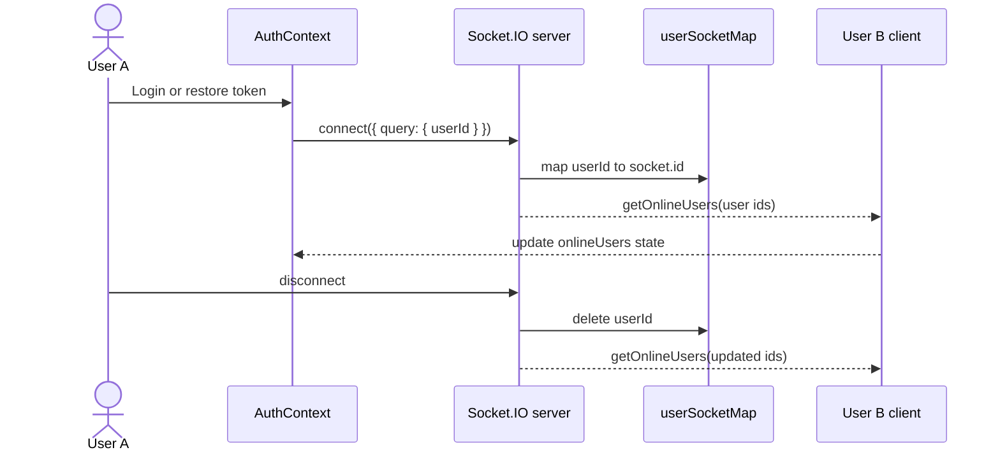
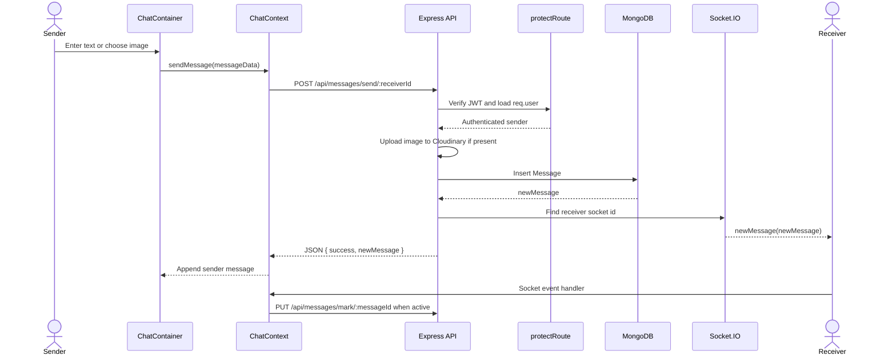
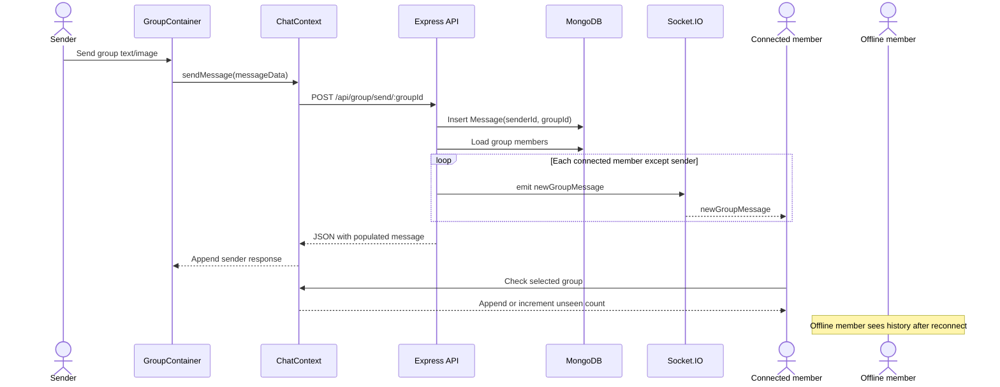

# ChatApp REST and WebSocket Notes

## REST versus WebSocket

### Why REST is used

REST is a good fit for operations that need a clear request and response:

- Signup and login
- Authentication check
- Profile updates
- Loading contacts
- Loading message history
- Sending and persisting a message
- Marking messages as seen
- Creating and administering groups

REST also makes recovery easy. If a browser misses a realtime event, it can request the durable history again.

### Why Socket.IO is used

A normal HTTP request is client initiated. Chat presence and new-message alerts are server initiated, so keeping a persistent Socket.IO connection avoids polling and gives low-latency updates.

Socket.IO is not exactly the same as a raw WebSocket. It provides a higher-level event protocol, automatic reconnection, fallbacks, rooms, acknowledgements, and namespaced events. The current application uses its event API and connection handling.

## Socket connection lifecycle



## Direct message sequence



## Group message sequence



## HTTP endpoint map

### Authentication

| Method | Endpoint | Protected | Purpose |
|---|---|---:|---|
| POST | `/api/auth/signup` | No | Create a user and return JWT |
| POST | `/api/auth/login` | No | Verify password and return JWT |
| GET | `/api/auth/check` | Yes | Restore authenticated user |
| PUT | `/api/auth/update-profile` | Yes | Update profile and optional image |

### Direct messaging

| Method | Endpoint | Protected | Purpose |
|---|---|---:|---|
| GET | `/api/messages/users` | Yes | Contacts and unseen counts |
| GET | `/api/messages/:id` | Yes | Direct history with a user |
| PUT | `/api/messages/mark/:id` | Yes | Mark a direct message seen |
| POST | `/api/messages/send/:id` | Yes | Persist and emit a direct message |

### Groups

| Method | Endpoint | Protected | Purpose |
|---|---|---:|---|
| POST | `/api/group/create` | Yes | Create a group |
| GET | `/api/group/my-groups` | Yes | List groups containing current user |
| DELETE | `/api/group/:id` | Yes | Delete group as admin |
| PUT | `/api/group/add-members/:id` | Yes | Add members as admin |
| GET | `/api/group/messages/:id` | Yes | Load group history |
| PUT | `/api/group/messages/mark/:id` | Yes | Mark group message seen |
| POST | `/api/group/send/:id` | Yes | Persist and broadcast group message |
| PUT | `/api/group/rename/:id` | Yes | Rename as admin |
| PUT | `/api/group/remove-member/:id` | Yes | Remove member as admin |
| PUT | `/api/group/transfer-admin/:id` | Yes | Transfer admin rights |
| PUT | `/api/group/leave/:id` | Yes | Leave a group if not admin |

## Event map

| Event | Direction | Meaning |
|---|---|---|
| `connection` | Client to server | A socket connected |
| `getOnlineUsers` | Server to all clients | Current connected user ids |
| `newMessage` | Server to receiver | New direct message |
| `newGroupMessage` | Server to group members | New group message |
| `disconnect` | Client/server lifecycle | Remove user from presence map |

## Socket versus database consistency

The database is the durable record. The socket event is a delivery optimization. The important order is:

1. Authenticate the request.
2. Persist the message.
3. Emit the event.
4. Return the persisted message in the HTTP response.

If step 3 fails, the message still exists and can be fetched later. A stronger production design would add delivery acknowledgements, retries, client-generated message ids, and an outbox/event queue if guaranteed event publication is required.

## How to improve the realtime design

### Multiple tabs and devices

Current shape:

```js
userSocketMap[userId] = socket.id;
```

Improved shape:

```js
Map<userId, Set<socketId>>
```

Alternatively, put every user socket into a room named by the user id and emit to that room.

### Socket authentication

Validate a JWT in `io.use((socket, next) => ...)`, derive the user id from the verified token, and do not trust an arbitrary query-string user id.

### Horizontal scaling

Use the Socket.IO Redis adapter. Without it, instance A does not know about sockets connected to instance B.

### Read receipts

A single `seen` field works for direct chats but not for a group with many readers. Use a `MessageRead` collection with `{ messageId, userId, seenAt }`, or store a read-state map when the group size and access pattern justify it.

### Authorization

For every group read, send, rename, remove, and message operation, load the group and verify the current user is a member. Authentication answers "who are you?"; authorization answers "are you allowed to do this?"
