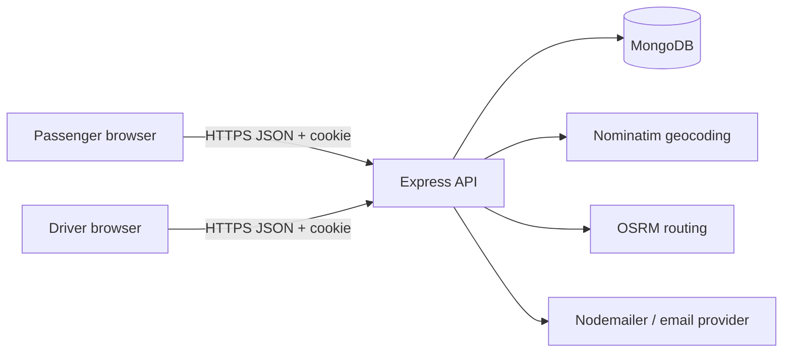
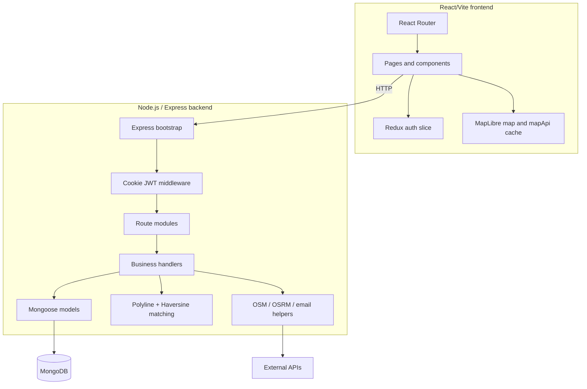
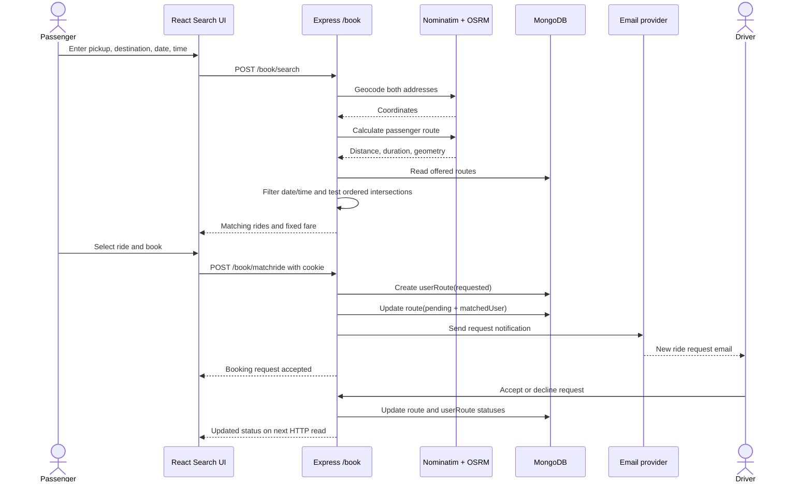
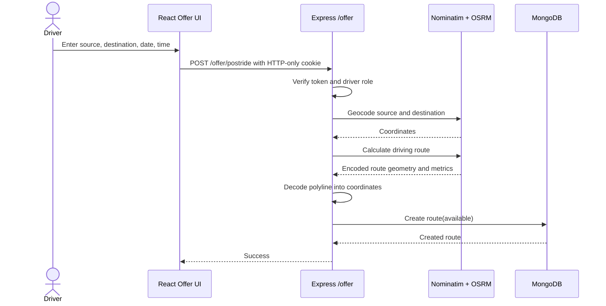
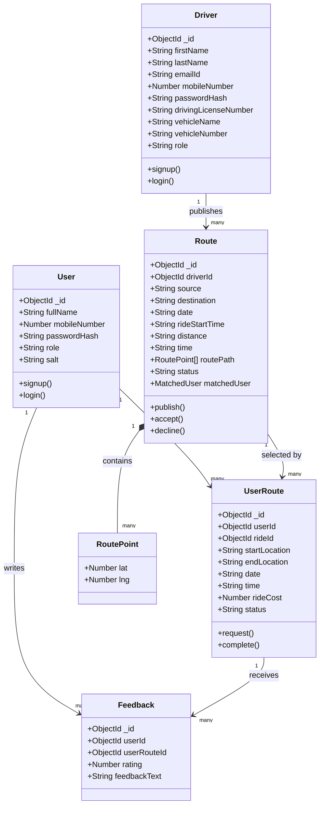
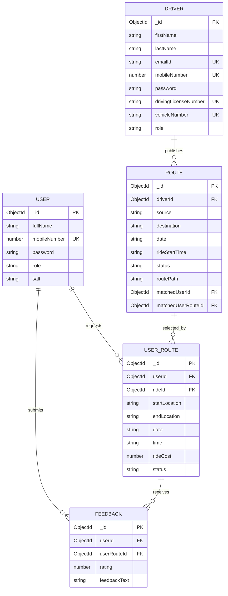
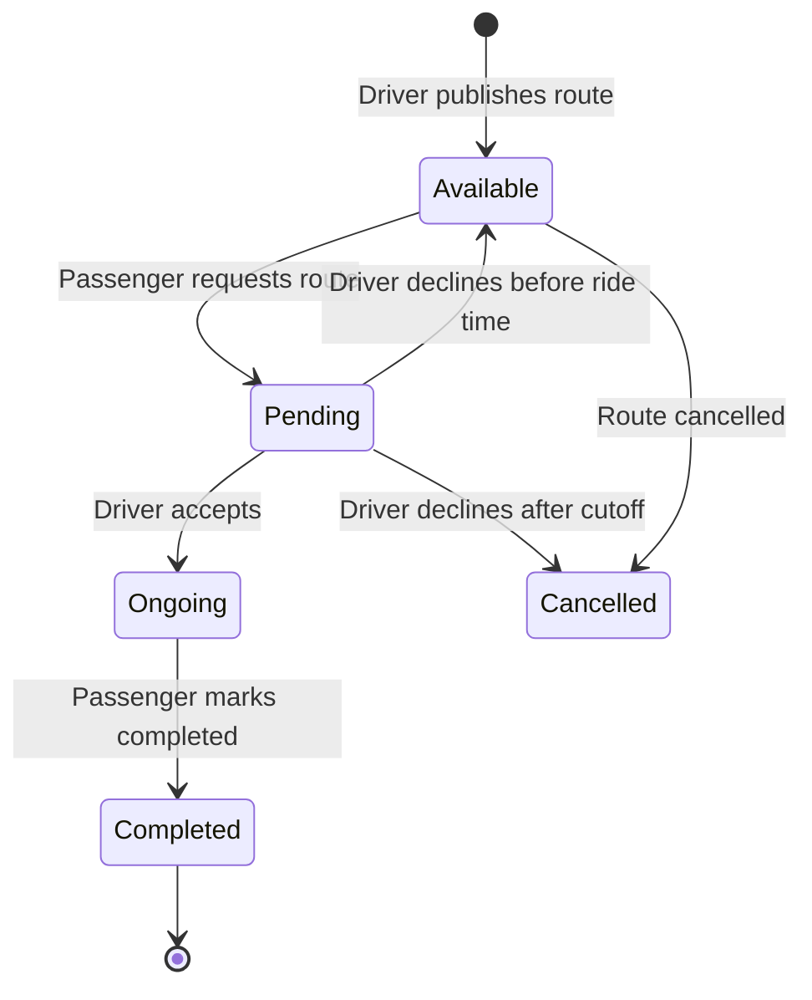

# RideShare Architecture and Diagrams

## System context diagram



## Component diagram



## Booking sequence diagram



## Driver offer sequence diagram



## Class diagram



## ER diagram



## Status transition diagram



## How WebSockets would fit

The current project does not implement WebSockets. It uses request/response HTTP and email notifications. A future implementation could add Socket.IO or native WebSocket support beside the Express server:

```text
Driver and passenger browsers
       | persistent WebSocket connection
       v
Socket gateway
       | authenticate JWT during handshake
       | join user:{id} and ride:{id} rooms
       v
Ride service + MongoDB
```

Useful events would be `ride:request-created`, `ride:accepted`, `ride:declined`, and `ride:completed`. The server should still persist the state in MongoDB first and emit an event after a successful update. HTTP endpoints remain useful for initial page loading, retries, refresh, and clients that are temporarily disconnected.

A good interview answer is: “WebSockets provide low-latency server push, while HTTP is request/response. In this project status changes currently become visible on a later HTTP fetch and the driver also receives email. I would add authenticated Socket.IO rooms for live status updates, but MongoDB would remain the source of truth.”
