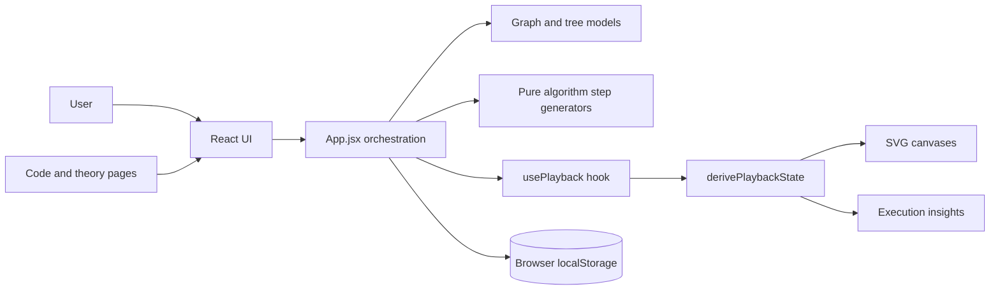

# Graphify Architecture

## System context



Graphify is a single-page application. There is no server-side component in the current implementation.

## Layer responsibilities

### Presentation layer

React components render controls and visual state. `GraphCanvas` and `TreeCanvas` render SVG. `Sidebar` presents the algorithm state in text and tables. `ControlPanel` changes playback state.

### Application orchestration

`App.jsx` handles mode/page selection, user actions, model updates, algorithm selection, and passing props to child components.

### Domain layer

Graph and tree model functions enforce editing rules. Algorithm functions operate on domain data and return event arrays. They do not import React or access the DOM.

### Playback projection

`usePlayback` owns the timeline cursor and timer. `derivePlaybackState` folds the prefix `steps[0..stepIndex)` into a display state containing visited nodes, active edges, queues, stacks, distances, parents, and paths.

### Persistence adapter

The only persistence adapter is browser `localStorage`, used for the graph save/load feature.

## Data flow

```text
User action
  -> App event handler
  -> graphModel/treeModel immutable update
  -> React state update
  -> child component props
  -> SVG render
```

Execution flow:

```text
Graph/tree state + selected algorithm
  -> algorithm step generator
  -> steps[]
  -> playback cursor
  -> derived playback state
  -> Canvas + Sidebar
```

## Domain schemas

### Graph

```js
{
  directed: Boolean,
  weighted: Boolean,
  gridMode: Boolean,
  nextNodeId: Number,
  nodes: [{ id: String, value: String, x: Number, y: Number }],
  edges: [{ id: String, from: String, to: String, weight: Number }]
}
```

### Tree

```js
{
  nextNodeId: Number,
  rootId: String | null,
  nodes: {
    [id]: {
      id: String,
      value: String,
      color: String,
      left: String | null,
      right: String | null
    }
  }
}
```

### Step event

Common events include:

```js
{ type: 'visit', node: '2', description: 'Visit node 2.' }
{ type: 'edge', from: '1', to: '2', description: 'Traverse edge 1 -> 2.' }
{ type: 'enqueue', node: '2', queue: ['2'] }
{ type: 'relax', from: '1', to: '2', distance: 4, distances: {} }
{ type: 'path', nodes: ['0', '1', '2'] }
```

The event union is informal JavaScript data rather than a TypeScript discriminated union. A future TypeScript migration could formalize it.

## Important invariants

- Node IDs are strings and are allocated from `nextNodeId`.
- A graph edge cannot be a self-loop through `addGraphEdge`.
- Duplicate edges are rejected, including reversed duplicates for undirected graphs.
- Removing a graph node also removes incident edges.
- A tree child can be attached only if it is not already attached elsewhere through `connectTreeNode`.
- A tree node has at most one left and one right child.
- A traversal must not visit a missing tree node.
- Playback indices are clamped between zero and the number of steps.

## Design trade-offs

### Centralized App state

Good for a small app and easy to follow. The downside is a large component with many unrelated states. Reducers or feature hooks would improve maintainability as features grow.

### Event list plus replay

Good for deterministic controls and explanation. The downside is repeated replay work on every cursor change. Checkpoints can reduce this for large traces.

### SVG

Good for individually interactive nodes and edges. For very large graphs, SVG DOM size and rerender cost become a limitation. WebGL or a graph rendering library would be candidates at larger scale.

### Local storage

Good for a zero-backend demo. It is not suitable for authentication, multi-user collaboration, audit history, or reliable cross-device persistence.

### Current Dijkstra implementation

The UI represents priority-queue actions, but the algorithm selects the next minimum by scanning a `Map`. This is acceptable for teaching and small graphs but should be replaced with a heap if performance is a requirement.

## Security and reliability considerations

- Treat loaded local storage as untrusted input and validate the schema before rendering.
- Restrict node labels and sanitize any future HTML rendering. React text rendering is safer than injecting HTML.
- If a server is added, authenticate WebSocket connections, authorize room membership, validate message schemas, limit message size/rate, and never trust client revisions.
- Add error states for malformed graphs, impossible references, and failed persistence.

## Extension roadmap

1. Add unit tests for models, algorithms, and `derivePlaybackState`.
2. Add a schema validator for imported/saved graphs.
3. Extract `useGraphEditor`, `useTreeEditor`, and `useExecution`.
4. Replace linear minimum selection in Dijkstra with a min-heap.
5. Add import/export JSON for graphs and trees.
6. Add a backend only for accounts, cloud persistence, or collaboration.
7. Use an ordered event protocol over WebSockets for shared rooms.
