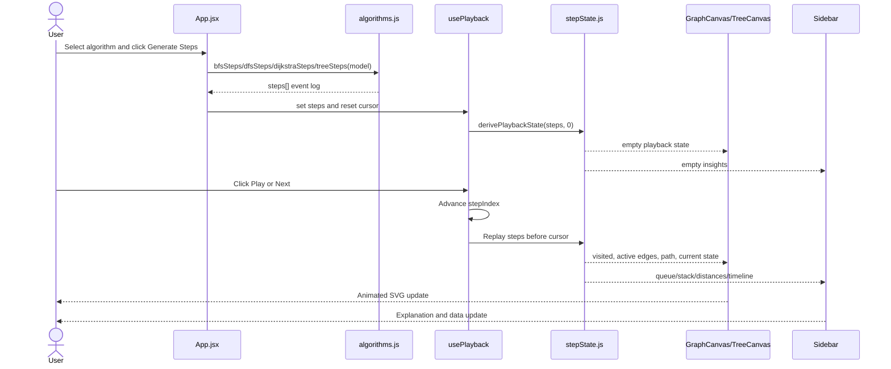
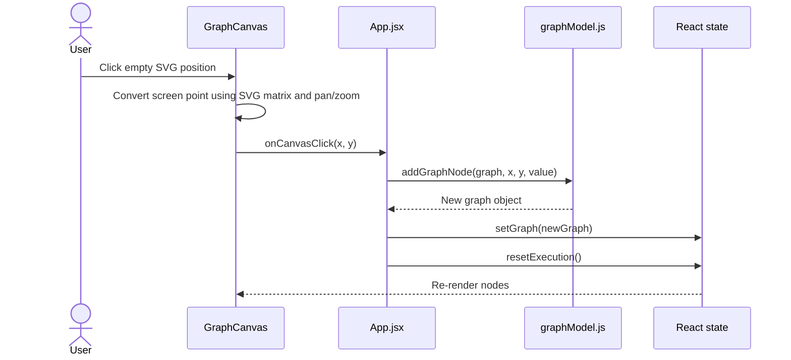
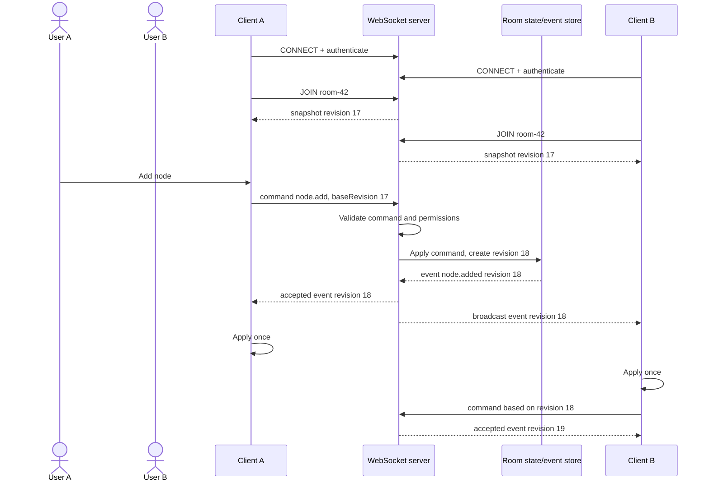
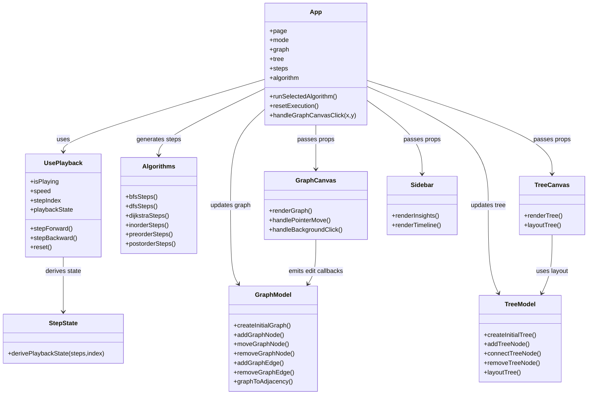
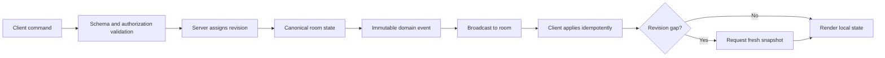

# Graphify Diagrams

## 1. Generate and play sequence



## 2. Graph editing sequence



## 3. Proposed WebSocket collaboration sequence

This is a future design, not current functionality.



## 4. Component/class relationship diagram

The code is functional React rather than class-based OO. This diagram uses a class-style view to show responsibilities and data dependencies.



## 5. Conceptual ER diagram

There is no relational database in the current project. This is a conceptual schema for the in-memory/local-storage data and a possible future backend. `Graph` and `Tree` are alternative workspace structures; a saved session may contain either or both.

```mermaid
erDiagram
    WORKSPACE ||--o| GRAPH : contains
    WORKSPACE ||--o| TREE : contains
    GRAPH ||--o{ GRAPH_NODE : has
    GRAPH ||--o{ GRAPH_EDGE : has
    GRAPH_NODE ||--o{ GRAPH_EDGE : from
    GRAPH_NODE ||--o{ GRAPH_EDGE : to
    TREE ||--o{ TREE_NODE : has
    TREE_NODE ||--o| TREE_NODE : left_child
    TREE_NODE ||--o| TREE_NODE : right_child
    WORKSPACE ||--o{ EXECUTION_STEP : records
    EXECUTION_STEP }o--o| GRAPH_NODE : references

    WORKSPACE {
      string id PK
      string mode
      int revision
      datetime updated_at
    }
    GRAPH {
      string id PK
      boolean directed
      boolean weighted
      boolean grid_mode
      int next_node_id
    }
    GRAPH_NODE {
      string id PK
      string graph_id FK
      string value
      float x
      float y
    }
    GRAPH_EDGE {
      string id PK
      string graph_id FK
      string from_node_id FK
      string to_node_id FK
      float weight
    }
    TREE {
      string id PK
      string root_node_id FK
      int next_node_id
    }
    TREE_NODE {
      string id PK
      string tree_id FK
      string value
      string color
      string left_child_id FK
      string right_child_id FK
    }
    EXECUTION_STEP {
      string id PK
      string workspace_id FK
      int sequence_number
      string type
      json payload
    }
```

## 6. WebSocket event model



Suggested event categories:

- `room.snapshot`
- `graph.node.added`
- `graph.node.moved`
- `graph.node.removed`
- `graph.edge.added`
- `graph.edge.removed`
- `execution.started`
- `execution.step`
- `execution.completed`
- `error`
